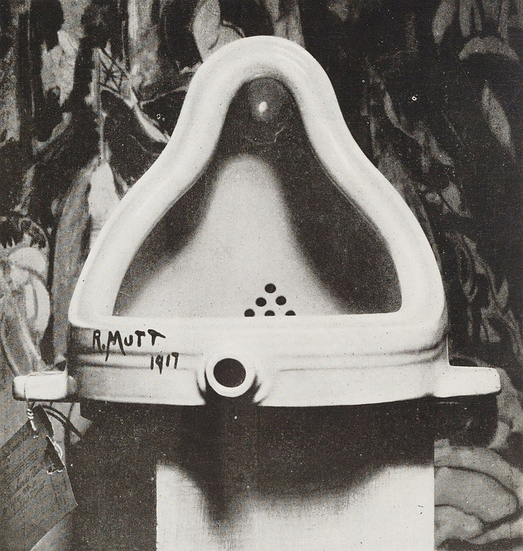
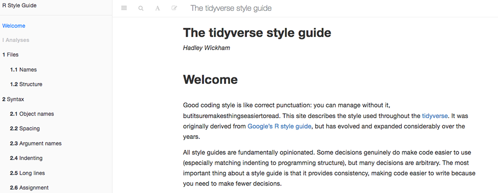
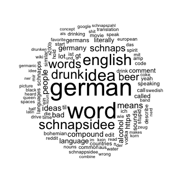

<style>
.reveal section p {
  color: black;
  font-family: 'Helvetica'; 
}

.reveal h1, .reveal h2, .reveal h3 {
  word-wrap: normal;
  -moz-hyphens: none;
}

.section .reveal .state-background {
    background: white;}
.section .reveal h1,
.section .reveal p {
    color: black;
    position: relative;
    top: 4%;}

.midcenter {
    position: fixed;
    top: 50%;
    left: 50%;
}

.flex { 
    display: flex; 
    justify-content: center; 
    align-items: center;
}

.footer {
    color: black; background: #E8E8E8;
    position: fixed; top: 90%;
    text-align:center; width:100%;
}

.small-code pre code {
  font-size: 1em;
}

</style>

Text as data: Mining digital trace data with R
========================================================
author: Lisa Hehnke
date: January 26, 2019
transition: fade  
  Twitter: [@DataPlanes](https://www.twitter.com/DataPlanes)  
  GitHub: [https://github.com/lhehnke](https://github.com/lhehnke)  


Outline
========================================================

1. Text data as digital trace data
 * Definition
 * Pros and cons
 * Challenges
2. Text mining in R
 * Infrastructure
 * Workflow
 * Text mining with *tidytext*
3. Q&A session


Purpose of this presentation
========================================================

* Get to know the perils and pitfalls of digital trace data
* Reflect challenges when working with this type of data
* Define the first (basic) work steps of a text mining project
* Implement these steps in R using *tidytext*


1.1 Buzzword bingo alert: Big Data
====================================
<div class="midcenter" style="margin-left:-300px; margin-top:-300px;">
</img>
</div>


1.1 Buzzword bingo alert: Big Data
====================================


***

What is 'Big Data'? 
https://datascience.berkeley.edu/what-is-big-data/


1.1 Buzzword bingo alert: Big Data
====================================


***

**Common criteria:**
* Volume: 2.23 billion monthly active Facebook users, 500 million tweets per day...
* Variety: texts, networks, videos, images, GPS data...
* Velocity: data is created continuously and in real time


1.1 Digital Trace Data
====================================

We live life in the network. When we wake up in the morning, we check our e-mail, make a quick phone call, walk outside (our movements captured by a high definition video camera), get on the bus (swiping our RFID mass transit cards) or drive (using a transponder to zip through the tolls). [...] We post blog entries confiding to the world our thoughts and feelings, or maintain personal social network profiles revealing our friendships and our tastes. Each of these transactions leaves **digital breadcrumbs** which, when pulled together, offer increasingly comprehensive pictures of both individuals and groups [...].

<font size="4">Source: Lazer et al. 2009, p. 721</font>


1.2 Digital Trace Data: Characteristics
====================================
1. Big
2. Always-on
3. Nonreactive
4. Incomplete
5. Inaccessible
6. Nonrepresentative
7. Drifting
8. Algorithmically confounded
9. Dirty
10. Sensitive

***


<font size="4">Source: Salganik 2017, chapter 2.3</font>


1.2 Digital Trace Data: Perils and pitfalls
====================================

### **Pros**
<font size="5">
* Data volume
* Data is always available and can be scraped almost instantly (e.g., during or shortly after important events)
* Often more unfiltered opinions and lower reactivity of users
* Lower costs for collecting digital trace data compared to traditional data (e.g., survey data)

</font>

***

### **Cons**
<font size="5">
* Data is often incomplete (e.g., comments can be deleted)
* 'Messiness' requires careful data wrangling
* Data is rarely representative
* Algorithms determine who will read or watch certain content
* Changes to the platform most likely cause changes in user behavior
* Sensitive data

</font>


1.3 Digital Trace Data: Challenges
====================================

### **General**
* Conclusions on causal mechanisms/causality cannot be inferred from results without having a rigorous research design -> descriptive statements only
* Ethical issues in dealing with users' data need to be discussed
* (Future) restrictions on collecting digital trace data?

### **Project-related**
* Platform-specific challenges?
* Multilingual text data


2.1 Text mining in R: Infrastructure
====================================

* Always use the current version of R and RStudio
* Document your work by commenting your code, using R Notebooks, and/or writing a README file on GitHub
* Use consistent and efficient coding style to enhance readability and reproducability (recommendation: [tidyverse style guide](https://style.tidyverse.org/))



2.1 Text mining in R: Infrastructure
====================================

* Use the latest CRAN version or, in case of more recent improvements, the respective developer version from GitHub (install using *devtools*)
* Useful packages:

|R package|Usage|
|---|---|
|quanteda|Quantitative analyses of text data|
|SnowballC|Stemming|
|stopwords|Stop word lists in multiple languages|
|tidytext|Text mining|
|tidyverse|Data wrangling/manipulation|
|tm|Text mining|
|wordcloud|Creating word clouds|


2.2 Text mining in R: Workflow
====================================

1. Problem definition and laying down objectives and/or research questions
2. Data collection
3. Data wrangling
4. Text preprocessing
5. Analysis
6. Documentation of results


2.2 Text mining in R: Workflow
====================================

1. Problem definition and laying down objectives and/or research questions
2. Data collection
3. Data wrangling
4. **Text preprocessing**
5. **Analysis**
6. Documentation of results


2.3 Text mining: Text preprocessing
========================================================

<small>
**Bag-of-words approach:** Treat text as 'bag' of its words and discard any information about the order, grammar or structure of the words -> word frequencies as most important feature

* Convert texts or words to lower case
* Remove HTML tags, URLs, emojis, whitspaces, punctuation, numbers
* Stemming, i.e., reducing words to their word stem (e.g., learning -> learn)
* Remove stop words (e.g., i, the, and, is)
* Tokenization (e.g., Today | I | learned)

*Note:* Please keep in mind that some of these steps are optional, depending on your objective and/or research question.
</small>


2.3 Text mining with tidytext 
========================================================
right: 70%


***

<font size="5.5">
* R package for text mining by Julia Silge & David Robinson
* 'Text Mining with R' is available online: https://www.tidytextmining.com/
* Tidy data (Wickham 2014) has a specific structure:
  1. Each variable is a column
  2. Each observation is a row
  3. Each type of observational unit is a table
* Tidy text format = table with one unit of text (e.g., a word) per row
* Advantage: compatibility with other R packages and functions -> *tm* requires corpus objects

</font>


2.3 Text mining with tidytext: Text preprocessing
========================================================
class: small-code

**Tokenize text and remove English stop words** (removes punctuation and converts text to lower case as well)

```r
tidy_df <- df %>%
  unnest_tokens(output = word, input) %>%
  anti_join(stop_words, by = "word")
```

**Remove numbers** (using regex to remove all numeric digits)

```r
tidy_df <- df %>%
   filter(!str_detect(word, "[0-9]"))
```
Regular expressions: https://regexr.com/ & https://github.com/gadenbuie/regexplain can work wonders!


2.3 Text mining with tidytext: Text preprocessing
========================================================
class: small-code

**Stemming** (using *wordStem()* from the *SnowballC* package)

```r
library(SnowballC)

tidy_df <- tidy_df %>%
  mutate(word = SnowballC::wordStem(word))
```


2.3 Text mining with tidytext: Preparation 
========================================================
class: small-code

**The following hands-on tutorial uses Reddit comments from its [Today I learned](https://www.reddit.com/r/todayilearned/) subreddit.**


```r
# Install and load pacman if not already installed
if (!require("pacman")) install.packages("pacman")
library(pacman)

# Load packages
p_load(glue, magrittr, RedditExtractoR, tidytext, tidyverse, wordcloud)
```


2.3 Text mining with tidytext: Preparation
========================================================
class: small-code


```r
# Get thread URLs in "Today I learned" subreddit
links <- reddit_urls(subreddit = "todayilearned", page_threshold = 10, sort_by = "relevance")

# Find most commented threads and extract selected thread URL
links %<>% arrange(desc(num_comments))
url <- links[7, "URL"]

# Get comments for selected thread
comments <- reddit_content(url)
```


```r
# Show title of TIL thread
comments[1, "title"]
```


```
[1] "TIL that \034Schnapsidee\035 is the German word for a ridiculous idea that only sounds good when you\031re drunk."
```


2.3 Text mining with tidytext: Preparation
========================================================
class: small-code


```r
# Set working directory
dir <- "/Users/Lisa/Documents/GitHub/workshop_minor/data"

# Import data
comments <- readRDS(file = glue('{dir}/comments.rds'))

# Filter comments and have a first look at the data
comments_df <- comments %>%
  select(comment) %>%
  glimpse
```

```
Observations: 491
Variables: 1
$ comment <chr> "There\030s also a word \036Schnapszahl\034 for the nu...
```


2.3 Text mining with tidytext: Text preprocessing
========================================================
class: small-code


```r
comments_df %>% head(5)
```

```
                                                                                                                                                         comment
1 There\030s also a word \036Schnapszahl\034 for the numbers 11,22,33... since they look like you\030re seeing a number doubled because you\030re drunk\n\n*like
2                                                                                                        grew up in Germany and TIL why it's called Schnapszahl.
3                                                                                                I'm german, and TIL why it's called Schnapsidee and Schnapszahl
4                                                                                                          Because it's a schnapps idea. Y'know. Like the drink.
5                                                                                                                     Ohhh so that\031s why I get W\xf2dka ideas
```


2.3 Text mining with tidytext: Text preprocessing
========================================================
class: small-code


```r
# Basic text cleaning
comments_tidy <- comments_df %>%
  unnest_tokens(output = word, input = comment) %>%
  anti_join(stop_words, by = "word")

# Show results
comments_tidy %>% head(5)
```

```
         word
1        word
2 schnapszahl
3    11,22,33
4     doubled
5       drunk
```


2.3 Text mining with tidytext: Text preprocessing
========================================================
class: small-code

**Further challenges of the data?**


```r
# Plot word cloud to give us a more fine-grained picture
comments_tidy %>%
  count(word) %>%
  with(wordcloud(word, n, max.words = 100, random.order = FALSE))
```




2.3 Text mining with tidytext: Additional text preprocessing
========================================================
class: small-code


```r
# Create own list with redundant words
remove_words <- tibble(
  word = c("http", "https", "amp", "gt"))

# Remove numbers, pre-specified words, and stem words (optional)
comments_tidy <- comments_tidy %>%
   filter(!str_detect(word, "[0-9]")) %>%
   anti_join(remove_words) # %>%
   #mutate(word = SnowballC::wordStem(word))

# Show results
comments_tidy %>% head(5)
```

```
         word
1        word
2 schnapszahl
3     doubled
4       drunk
5        grew
```


2.3 Text mining with tidytext: Additional text preprocessing
========================================================
class: small-code

**Are we really done yet?**


```r
# Plot another word cloud
comments_tidy %>%
  count(word) %>%
  with(wordcloud(word, n, max.words = 100, random.order = FALSE))
```


2.3 Text mining with tidytext: Additional text preprocessing
========================================================
class: small-code

**Non-English or multilingual text data**


```r
# Stop words for foreign languages (here: German)
stop_german <- data.frame(word = stopwords::stopwords("de"), stringsAsFactors = F)

# Multilingual approaches are feasible as well
# stop_df <- data.frame(word = c(stopwords::stopwords(language = "de"), stopwords::stopwords(language = "en")))

# Clean text data by unnesting tokens and removing German stop words
comments_tidy_final <- comments_tidy %>%
  anti_join(stop_german)
```


2.3 Text mining with tidytext: First analyses
========================================================
class: small-code


```r
# Calculate frequencies
comments_wordfreq <- comments_tidy_final %>%
  count(word, sort = TRUE)

# Calculate and plot most frequent words
comments_tidy_final %>%
  count(word, sort = TRUE) %>%
  top_n(10, n) %>%
  ungroup() %>%
  mutate(word = reorder(word, n)) %>%
  ggplot(aes(word, n)) +
  geom_col() +
  theme(text = element_text(size = 25)) + 
  xlab("") + ylab("") + ggtitle("Most common words in Reddit comments", subtitle = " ") + 
  ylim(0, 100) + coord_flip() + theme_minimal()
```


2.3 Text mining with tidytext: First analyses
========================================================
class: small-code


2.3 Text mining with tidytext: First analyses
========================================================
class: small-code


```r
# Plot final word cloud
comments_tidy_final %>%
  count(word) %>%
  with(wordcloud(word, n, max.words = 100, random.order = FALSE))
```


2.4 Text mining: Quantitative text analysis
========================================================

**Four principles** (Grimmer & Stewart 2013)

1. All quantitative models of language are wrong — but some are useful. 

2. Quantitative methods for text augment humans, not replace them. 

3. There is no globally best method for automated text analysis.

4. Validate, validate, validate.


2.4 Text mining: Advanced methodological approaches
========================================================

<div class="flex">
</img>
</div>

<font size="4">Source: Grimmer & Stewart 2013, p. 2</font>


3. Q&A session
========================================================

<div class="flex">
</img>
</div>


References
========================================================

Grimmer, J., & Stewart, B. M. (2013). Text as data: The promise and pitfalls of automatic content analysis methods for political texts. Political Analysis, 21(3), 267-297.

Lazer, D., Pentland, A. S., Adamic, L., Aral, S., Barabasi, A. L., et al. (2009). Life in the network: The coming age of computational social science. Science, 323(5915), 721.

Salganik, M. J. (2017). Bit by bit: Social Research in the digital age. Princeton University Press. Available online: https://www.bitbybitbook.com/en/1st-ed/preface/.


Additional resources
========================================================

https://compsocialscience.github.io/summer-institute/2018/

https://github.com/cbail/textasdata

https://github.com/pablobarbera/ECPR-SC105
